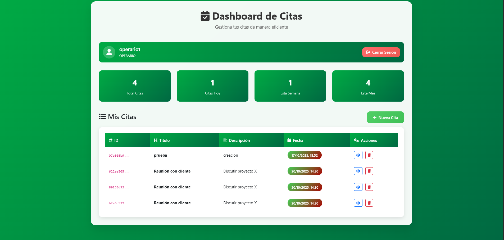

# Sistema de Citas - Laravel (Hexagonal + DDD)



## Descripción  
Sistema avanzado de gestión de citas desarrollado en Laravel implementando **Arquitectura Hexagonal** y **Domain-Driven Design (DDD)** para una aplicación escalable y mantenible.

```bash
# Clonar repositorio
git clone https://github.com/sebastian1908/AgendarCitaRepo.git

# Instalar dependencias
composer install
npm install

# Configurar entorno
cp .env.example .env
php artisan key:generate

# Base de datos
php artisan migrate
php artisan db:seed

# Ejecutar
php artisan serve